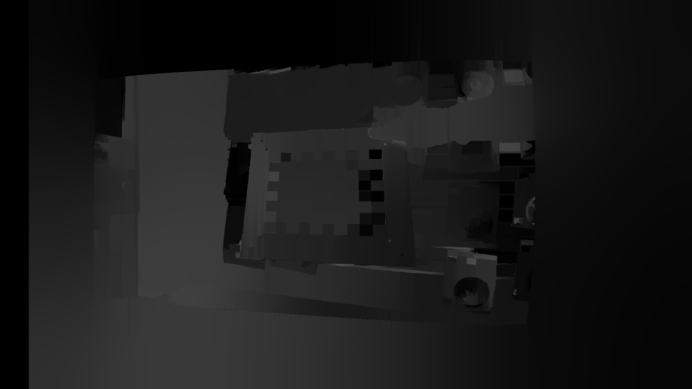

# Camera-Calibration-Reconstruct

This project is intend to provide code for "stereo calibration", "stereo rectification", "stereo matching", "disparity calculation", "3d depth estimation"


## 1.Directory

```
.
├── config       # camera parameter
├── data         # calibration images
├── demo         # demo files
├── libs         # functions for proceesing files
├── scripts       # script
│   ├── mono_camera_calibration.sh     # script for monocular calibration
│   └── stereo_camera_calibration.sh   # script for stereo calibration
├── mono_camera_calibration.py            # monocular calibration
├── stereo_camera_calibration.py          # stereo calibration
├── requirements.txt                      # env
└── README.md

```

# 2. Environment

- use [requirements.txt](requirements.txt)
- opencv-python
- opencv-contrib-python

## 3.Stereo calibration

#### (1) [monocular calibration](scripts/mono_camera_calibration.sh)

- `bash scripts/mono_camera_calibration.sh`
- if error is over 0.1, redo calbration

get left_cam.yml and right_cam.yml


#### (2) [stereo calibration](scripts/stereo_camera_calibration.sh)
- `bash scripts/stereo_camera_calibration.sh`
- if error is over 0.1, redo calbration

get stereo_cam.yml

## 4.Disparity and depth for 3d reconstruction

- Run demo

|      para           |type    |example    |
|:-------------------:|:------:|:----------|
| stereo_file    | str    | stereo_camera_parameter    |
| left_video          | str    | left_video_path       |
| right_video         | str    | right_video_path      |
| left_file           | str    | left_image_path       |
| right_file          | str    | right_image_path      |
| filter              | bool   | if_to_use_filter      |


```bash
python demo.py  \
  --stereo_file "configs/lenacv-camera/stereo_cam.yml" \
  --left_video "data/lenacv-video/left_video.avi" \
  --right_video "data/lenacv-video/right_video.avi" \
  --filter True
```

|      left                                         |      right                                             |
|:-------------------------------------------------:|:------------------------------------------------------:|
|                       |                           |
|      **disparity(without wsl filter)**                           |**disparity(without wsl filter)**                                                  |
|                  |                       |
|      **disparity(with wsl filter)**                             |**disparity(with wsl filter)**                                                  |
|           |                       |

- Video_result

 

  
## 7.Reference

- https://github.com/aliyasineser/stereoDepth
- https://www.cnblogs.com/riddick/p/8486223.html
- https://blog.csdn.net/dulingwen/article/details/98071584


